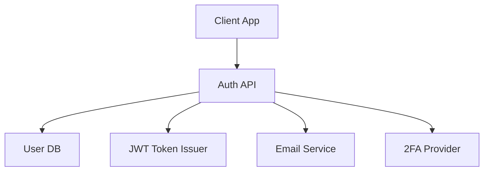

# User Authentication API Documentation

## 1. Introduction

### Overview  
The **User Authentication API** is responsible for securing access to an e-commerce platform by handling user registration, login, logout, password management, and token-based session control. It ensures only authorized users can access personal accounts, place orders, and manage their data.

### Why It Matters  
Security and user experience are critical in e-commerce. Robust authentication prevents fraud, protects personal data, and supports features like persistent login, two-factor authentication (2FA), and social login.

### Who This Guide is For  
- Backend/API developers building secure user systems  
- Frontend developers implementing sign-in flows  
- DevOps teams managing identity and access policies  
- QA testers validating authentication workflows  

---

## 2. Key Terminology

- **JWT (JSON Web Token)**: A compact, URL-safe token used to securely transmit identity and claims  
- **Refresh Token**: A long-lived token used to obtain a new access token without re-authentication  
- **2FA**: Two-factor authentication, often via SMS, email, or authenticator app  
- **Session**: The period in which a user remains authenticated  
- **OAuth**: A protocol for third-party authentication (e.g., Google, Facebook)  
- **SSO**: Single Sign-On across multiple services  
- **Token Expiry**: The duration for which access tokens remain valid  
- **CSRF**: Cross-Site Request Forgery, a security threat during session handling  
- **Email Verification**: Confirmation to activate a new account  

---

## 3. Technical Overview

### Architecture Overview

Auth API: Manages all authentication endpoints

User DB: Stores hashed passwords and profile info

Token Issuer: Generates and validates access/refresh tokens

Email Service: Sends confirmation, reset, and OTP emails

2FA Provider: Optional second-layer verification via third-party APIs

4. Step-by-Step Guide or Workflow
4.1 User Registration
http
Copy
Edit
POST /api/auth/register
Request:

json
Copy
Edit
{
  "name": "Jane Doe",
  "email": "jane@example.com",
  "password": "SecurePass123!"
}
Response:

json
Copy
Edit
{
  "message": "Registration successful. Please verify your email."
}
4.2 Email Verification
http
Copy
Edit
GET /api/auth/verify-email?token=abc123
Response:

json
Copy
Edit
{
  "message": "Email verified successfully."
}
4.3 Login
http
Copy
Edit
POST /api/auth/login
Request:

json
Copy
Edit
{
  "email": "jane@example.com",
  "password": "SecurePass123!"
}
Response:

json
Copy
Edit
{
  "access_token": "eyJhbGci...",
  "refresh_token": "d7f0e2a...",
  "expires_in": 3600
}
4.4 Token Refresh
http
Copy
Edit
POST /api/auth/token/refresh
Request:

json
Copy
Edit
{
  "refresh_token": "d7f0e2a..."
}
Response:

json
Copy
Edit
{
  "access_token": "newJWT...",
  "expires_in": 3600
}
4.5 Logout
http
Copy
Edit
POST /api/auth/logout
Request:

json
Copy
Edit
{
  "refresh_token": "d7f0e2a..."
}
Response:

json
Copy
Edit
{
  "message": "Logged out successfully."
}
4.6 Forgot Password
http
Copy
Edit
POST /api/auth/forgot-password
Request:

json
Copy
Edit
{
  "email": "jane@example.com"
}
Response:

json
Copy
Edit
{
  "message": "Password reset email sent."
}
4.7 Reset Password
http
Copy
Edit
POST /api/auth/reset-password
Request:

json
Copy
Edit
{
  "token": "reset-token-abc123",
  "new_password": "NewPass456!"
}
Response:

json
Copy
Edit
{
  "message": "Password updated successfully."
}
4.8 Optional: Social Login (OAuth)
http
Copy
Edit
GET /api/auth/oauth/google
Redirects to Google OAuth for authentication.

5. Best Practices
Use HTTPS: Always encrypt authentication traffic

Hash Passwords with Bcrypt/Argon2: Avoid storing plain-text passwords

Use Short-Lived Access Tokens: Reduce risk of token theft

Implement Refresh Token Rotation: Prevent token reuse

Throttle Login Attempts: Mitigate brute force attacks

Enable 2FA for Sensitive Actions: Add extra protection for checkout or profile updates

Use Secure Cookies with HttpOnly: For session storage on the web

Audit Authentication Events: Log all auth actions for compliance

6. Common Issues & Troubleshooting
Issue	Cause	Resolution
Invalid token	Expired or malformed JWT	Prompt re-authentication
Login fails	Incorrect password or unverified email	Ensure email is confirmed
CSRF attack	Unprotected session cookies	Use CSRF tokens and secure headers
Token reuse attack	Old refresh token used again	Enable refresh token rotation
2FA not received	SMS/email delays	Allow alternate 2FA methods

7. References
JWT Specification

OWASP Authentication Cheat Sheet

OAuth 2.0 Docs

Google Identity Platform

Bcrypt Password Hashing

8. Appendix
Sample JWT Payload
json
Copy
Edit
{
  "sub": "user_123456",
  "email": "jane@example.com",
  "iat": 1719480000,
  "exp": 1719483600,
  "role": "customer"
}
Mermaid Diagram: Auth Workflow
mermaid
Copy
Edit
sequenceDiagram
    participant Client
    participant AuthAPI
    participant EmailService
    participant DB

    Client->>AuthAPI: POST /register
    AuthAPI->>DB: Save user (inactive)
    AuthAPI->>EmailService: Send verification email
    Client->>AuthAPI: GET /verify-email
    AuthAPI->>DB: Activate user
    Client->>AuthAPI: POST /login
    AuthAPI->>DB: Validate credentials
    AuthAPI->>Client: Return access & refresh tokens
    Client->>AuthAPI: POST /token/refresh
    AuthAPI->>Client: Return new access token
Curl Example: Login
bash
Copy
Edit
curl -X POST https://api.example.com/api/auth/login \
  -H "Content-Type: application/json" \
  -d '{"email":"jane@example.com", "password":"SecurePass123!"}'
Authentication Token Expiry Policy
Token Type	Duration	Storage
Access Token	1 hour	LocalStorage / Cookie (HttpOnly)
Refresh Token	7 days	HttpOnly Cookie or secure server storage
